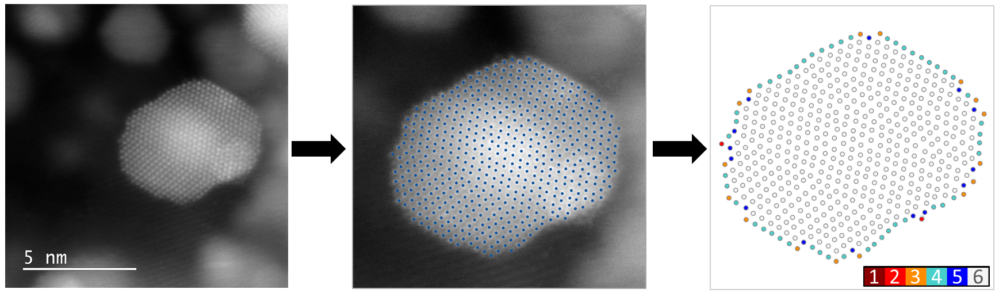
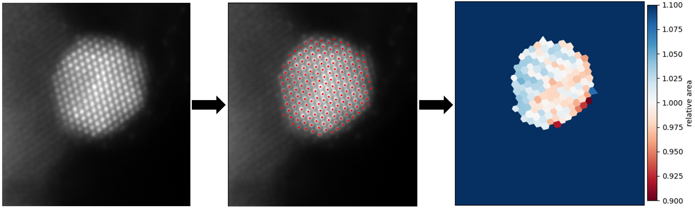

# Atomically-resolved-images

Code for image analysis of atomically resolved scanning transmission electron micrographs (STEM) of nanoparticles. The code was developed and tested on images of different metallic and metallic alloy nanoparticles, which act as catalysts for chemical reactions in clean hydrogen production and usage. 

The work encompasses:
* several preprocessing routines, 
* determination of atomic column positions including helper functions, 
* determination of the columns' nearest neighbors,
* computing the Voronoi diagram to determine and visualize cell areas,
* segmentation of nanoparticles into structurally different parts, 
* and alignment of identical location images.

Part of that code was written in the scope of my master's thesis, which is also a part of the repository. The thesis was a part of a Master's degree in Physics, awarded by the University of Ljubljana. The implementations largely follow ideas from the cited references.

If you use the code, **please cite the following papers**: 

* Resolving the nanoparticles’ structure-property relationships at the atomic level: a study of Pt-based electrocatalysts. *iScience* (2021). https://doi.org/10.1016/j.isci.2021.102102
* Observing, tracking and analysing electrochemically induced atomic-scale structural changes of an individual Pt-Co nanoparticle as a fuel cell electrocatalyst by combining modified floating electrode and identical location electron microscopy. *Electrochimica Acta* (2021). https://doi.org/10.1016/j.electacta.2021.138513 
* for the **nearest neighbor analysis**, cite: Atomically-resolved structural changes of ceramic supported nanoparticulate oxygen evolution reaction Ir catalyst. *Electrochimica Acta* (2022). https://doi.org/10.1016/j.electacta.2022.140800 
* for the **cell area analysis**, cite: Metal−support interaction between titanium oxynitride and Pt nanoparticles enables efficient low-Pt-loaded high-performance electrodes at relevant oxygen reduction reaction current densities. *ACS Catalysis* (2024). https://doi.org/10.1021/acscatal.3c03883

Determining atomic column positions:

  

Segmenting an image into grains:

  

Aligning identical location images:

  

Nearest neighbor analysis:

  

Cell area analysis:

  

