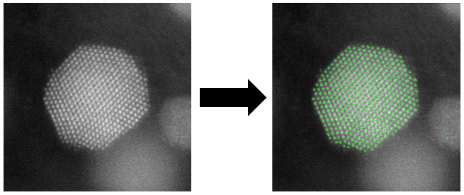
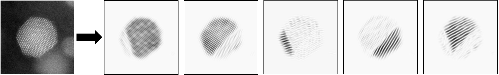
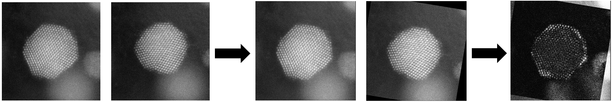

# Atomically-resolved-images
Code for image analysis of atomically resolved electron micrographs.

This repository contains code, written in the scope of my master's thesis, and the thesis itself. The thesis was a part of a Master's degree in Physics, awarded by the University of Ljubljana. 

The work encompasses several preprocessing routines, determination of atomic column positions, segmentation of images into structurally different parts, and alignment of identical location images. The implementations largely follow ideas from the cited references.

If you use the code, please cite the following papers: 

* Resolving the nanoparticles’ structure-property relationships at the atomic level: a study of Pt-based electrocatalysts. *iScience* (2021). https://doi.org/10.1016/j.isci.2021.102102
* Observing, tracking and analysing electrochemically induced atomic-scale structural changes of an individual Pt-Co nanoparticle as a fuel cell electrocatalyst by combining modified floating electrode and identical location electron microscopy. *Electrochimica Acta* (2021). https://doi.org/10.1016/j.electacta.2021.138513 

Determining atomic column positions:

  

Segmenting an image into grains:

  

Aligning identical location images:

  

